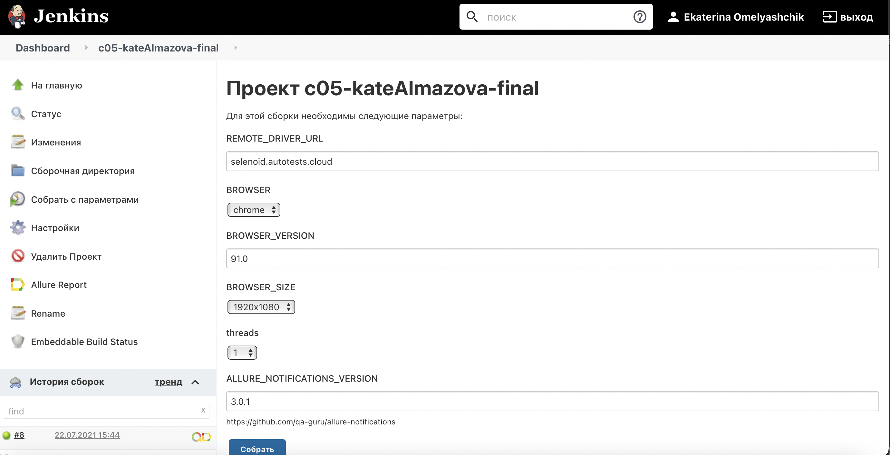

# UI tests for [Demo Web Shop](http://demowebshop.tricentis.com) and API test for [Book Store](https://demoqa.com/swagger/)
## Covered features:
- [x] UI: Registration (positive and negative tests)
- [x] UI + API: Payment in different ways
- [x] API: Creation account (positive and negative tests)
- [x] API: Getting info about books
## Technology Stack


This project has written in [Java](https://go.java/) using [Selenide](https://selenide.org) framework
for UI-tests and [REST-Assured](https://rest-assured.io) for API-test. 
[Gradle](https://gradle.org) is used to build the project.
[JUnit 5](https://junit.org/junit5/) is used as a unit-testing framework.
[Allure Report](http://allure.qatools.ru), [Allure TestOps](https://docs.qameta.io/allure-testops/), 
[Jira](https://www.atlassian.com/software/jira) and 
[Telegram Bot](https://core.telegram.org/bots) are used to visualize test results.
Tests are launched from [Jenkins](). [Selenoid](https://aerokube.com/selenoid/) is used to run browsers in 
[Docker containers](https://www.docker.com/resources/what-container).


## Description
You can run tests by configuring the following parameters:

- Remote server
- Browser (Chrome, Firefox, Opera, Safari)
- Browser Version  
- Browser Size
- Number of threads
  



### To run tests locally (default):
```
gradle clean test 
```
### To run tests on Selenoid:

```
gradle clean test 
    -Dweb.remote.driver.url=selenoid.autotests.cloud
    -Dweb.remote.driver.user={USER}
    -Dweb.remote.driver.password={PASSWORD}
    * -Dweb.browser={BROWSER}
    * -Dweb.browser.version={BROWSER_VERSION}
    * -Dweb.browser.size={BROWSER_SIZE}
    * -Dthreads={THREADS_AMOUNT}
```
*optional
